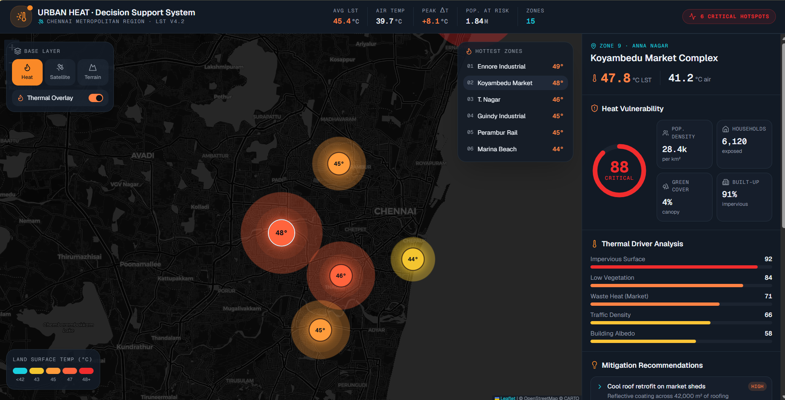
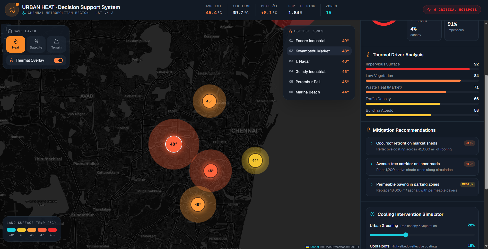
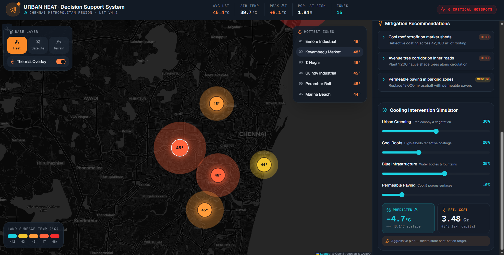

# 🌆 Urban Heat Decision Support System

An interactive geospatial dashboard built using **Next.js**, **React**, **TypeScript**, and **Leaflet** to analyze Urban Heat Island (UHI) patterns, identify heat-vulnerable zones, and simulate mitigation strategies for smarter urban planning.

🌐 **Live Demo:** https://urban-heat-dashboard-alpha.vercel.app/

📂 **GitHub Repository:** https://github.com/SanjayS-CSBS/urban-heat-dashboard

---

## 📖 Overview

Urban Heat Islands are areas within cities that experience significantly higher temperatures due to dense construction, limited vegetation, and human activities.

This project visualizes thermal hotspots across Chennai using an interactive dashboard that enables users to:

- Monitor high-temperature zones
- Analyze heat vulnerability
- Understand thermal drivers
- Explore mitigation recommendations
- Simulate cooling interventions and their impact

---

# 📸 Dashboard Preview

## 🗺️ Main Dashboard

> Interactive heat map highlighting temperature hotspots across Chennai.



---

## 📊 Heat Vulnerability & Thermal Analysis

> Analyze population exposure, vulnerability indicators, and the major contributors to urban heat.



---

## ❄️ Cooling Intervention Simulator

> Simulate different mitigation strategies and estimate temperature reduction and implementation cost.



---

# ✨ Features

- 🌡️ Interactive Urban Heat Map
- 📍 Hotspot Detection
- 📊 Heat Vulnerability Analysis
- 🌳 Thermal Driver Analysis
- 💡 Mitigation Recommendations
- ❄️ Cooling Intervention Simulator
- 📈 Estimated Temperature Reduction
- 💰 Cost Estimation
- 🌍 Interactive GIS Visualization

---

# 🛠️ Tech Stack

| Technology | Purpose |
|------------|---------|
| Next.js | Frontend Framework |
| React | UI Components |
| TypeScript | Type Safety |
| Tailwind CSS | Styling |
| Leaflet | Interactive Maps |
| React Leaflet | Map Components |
| OpenStreetMap | Base Map |

---

# 📂 Project Structure

```
app/
components/
lib/
public/
screenshots/
README.md
```

---

# 🚀 Getting Started

### Clone the repository

```bash
git clone https://github.com/SanjayS-CSBS/urban-heat-dashboard.git
```

### Install dependencies

```bash
npm install
```

### Start the development server

```bash
npm run dev
```

Open:

```
http://localhost:3000
```

---

# 🎯 Future Improvements

- Live satellite/LST data integration
- AI-powered hotspot prediction
- Time-series heat analysis
- Climate data APIs
- Mobile responsive dashboard
- Export analytical reports

---

# 💡 Use Cases

- Smart City Planning
- Climate Resilience Studies
- Urban Planning
- Disaster Management
- Environmental Research
- Government Decision Support

---

# 👨‍💻 Developer

**Sanjay S**

- GitHub: https://github.com/SanjayS-CSBS

---

## ⭐ If you found this project interesting, consider giving it a star!